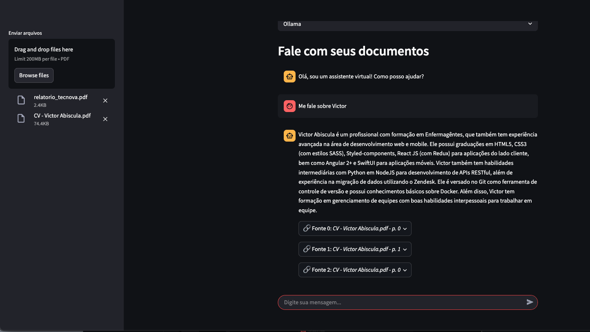

# LLM-ConvoBotAI

Este é um projeto de chatbot AI que utiliza modelos locais de linguagem (LLM) para conversas contínuas, mantendo o contexto da sessão. Ou seja, durante uma conversa, o chatbot consegue “lembrar” das interações anteriores, permitindo uma experiência mais fluida e natural.

Além disso, o LLM-ConvoBotAI agora conta com um novo fluxo interativo que permite ao usuário escolher entre:
• Conversar com o assistente (modo tradicional de chatbot)
• Analisar um arquivo/documento com a ajuda da IA (modo análise)

Esse diferencial torna o projeto mais flexível e poderoso, permitindo interações tanto informais quanto análises de conteúdo mais estruturadas.



## 🧠 Diferenças para o projeto anterior

Diferente do projeto [AI-chatbot](https://github.com/Abiscula/AI-chatbot) que implementei com o Groq, este oferece maior flexibilidade na escolha do modelo de linguagem, permitindo ao usuário selecionar entre uma ampla variedade de LLMs (como GPT-3, Phi-3, entre outros), conforme suas necessidades.

O suporte a diferentes provedores — Ollama, Hugging Face, e modelo manual local — permite que o chatbot seja executado em diversos sistemas operacionais com liberdade total de configuração.

Além disso, o novo sistema de fluxo do assistente permite que o usuário:
• Escolha entre iniciar uma conversa tradicional com o chatbot ou fazer a leitura e análise de um arquivo (como PDFs, textos, etc.).
• Utilize o mesmo modelo de linguagem em ambos os fluxos.
• Mantenha o contexto da sessão para interações mais inteligentes.

## 🛠 Tecnologias Utilizadas

- **Python**: Linguagem de programação principal.
- **Ollama**: Plataforma para executar LLMs localmente.
- **Phi-3 (quantized)**: Modelo de linguagem para ser carregado manualmente.
- **Streamlit**: Framework para criar a interface interativa do chatbot.
- **LangChain**: Biblioteca usada para integrar LLMs e orquestrar conversas.
- **Hugging Face**: Para usar modelos pré-treinados via API.

## 🚀 Como Rodar o Projeto

### 1. Pré-requisitos

- **Python 3.8+**
- **Pip** para instalar as dependências
- **Ollama**: Caso deseje utilizar o Ollama como backend para o modelo local
- **Hugging Face API Key**: Caso deseje usar modelos da Hugging Face

### 2. Configurando o Ambiente

#### 1. Clone este repositório para o seu ambiente local:

```bash
git clone <URL_DO_REPOSITORIO>
cd <DIRETORIO_DO_REPOSITORIO>
```

#### 2. Crie um ambiente virtual:

```bash
 python3 -m venv venv
 source venv/bin/activate  # Para Linux/MacOS
 venv\Scripts\activate     # Para Windows
```

#### 3. Instale as dependências do projeto:

```bash
 pip install -r requirements.txt
```

#### 4. Configure a Hugging Face API Key:

Para usar modelos da Hugging Face, você precisa configurar a chave da API. Crie um arquivo .env no diretório raiz do projeto e adicione a seguinte linha:

```bash
 HF_API_KEY=seu_token_da_hugging_face
```

Substitua seu_token_da_hugging_face pelo seu token da API da Hugging Face, que pode ser obtido em Hugging Face - API.

### 3. Rodando o Modelo

#### Opção 1: Usando Ollama

Para usar o Ollama, você precisará instalar o aplicativo Ollama localmente.

1.  Instale o Ollama:
    • Para Windows: Faça o download e instale o Ollama a partir do site oficial do Ollama.
    • Para MacOS e Linux: Utilize o Homebrew para instalar o Ollama:

```bash
 brew install ollama
```

2.  Inicie o servidor Ollama:

Execute o seguinte comando para iniciar o servidor Ollama em sua máquina:

```bash
 ollama serve
```

#### Opção 2: Usando o Modelo Manual (para Windows)

Caso esteja em um dispositivo Windows ou não queira usar o Ollama, você pode optar pelo modelo manual (Phi-3).

1. Baixe o modelo Phi-3 quantizado:
   • Baixe o modelo manualmente e coloque-o em um diretório específico dentro do seu projeto.
2. Rodando o chatbot com Phi-3:
   O modelo será carregado manualmente a partir do diretório onde você o colocou.
3. Iniciar o chatbot:
   Quando você executar o código, o modelo manual será utilizado no lugar do Ollama.

#### Opção 3: Usando Hugging Face

Se você preferir usar um modelo pré-treinado da Hugging Face, você pode configurar o projeto para se conectar à API da Hugging Face.

1. Certifique-se de que o arquivo .env está configurado com a sua API Key (conforme a etapa 4 do item anterior).
2. Escolha um modelo na Hugging Face:
   Vá até Hugging Face Models e escolha um modelo de sua preferência.
3. Execute o chatbot:
   Com a API configurada, basta rodar o chatbot com o modelo desejado. O código irá automaticamente se conectar à Hugging Face para carregar o modelo e utilizá-lo para gerar as respostas.

## 🖥️ Compatibilidade

| Modelo usado  | Windows | MacOS | Linux |
| ------------- | ------- | ----- | ----- |
| Ollama        | ✅      | ✅    | ✅    |
| Modelo Manual | ✅      | ❌    | ❌    |
| Hugging Face  | ✅      | ✅    | ✅    |
